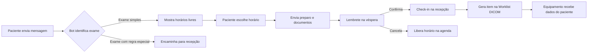

# PRD — Módulo de Agendamento de Exames de Imagem

> **Autor:** Henrique Lima · **Versão:** 0.1 (rascunho) · **Status:** em validação
> Projeto pessoal: sistema RIS/PACS para clínicas de diagnóstico por imagem.
> Itens marcados com **[VALIDAR]** são premissas a confirmar com a operação.

---

## 1. Problema

Em clínicas de diagnóstico por imagem de médio porte, o agendamento costuma depender do telefone e do WhatsApp manual da recepção. Isso gera:

- **Fila no atendimento:** horários de pico com ligações perdidas e mensagens sem resposta. **[VALIDAR: % de chamadas não atendidas]**
- **Retrabalho:** os dados do paciente são digitados no agendamento e de novo no equipamento (modalidade).
- **Erros de preparo:** o paciente chega sem jejum ou sem o pedido médico e o exame é remarcado. **[VALIDAR: taxa de remarcação]**
- **Faltas (no-show)** sem confirmação prévia, deixando horários ociosos nos equipamentos.

## 2. Objetivo e métricas de sucesso

Permitir que o paciente agende sozinho, com regras de cada exame aplicadas automaticamente, e que o agendamento alimente o fluxo técnico sem redigitação.

| Métrica | Linha de base | Meta (3 meses após go-live) |
| --- | --- | --- |
| Agendamentos feitos sem a recepção | **[VALIDAR]** | 40% |
| Taxa de no-show | **[VALIDAR]** | −30% |
| Exames remarcados por preparo incorreto | **[VALIDAR]** | −50% |
| Redigitação de dados no equipamento | 100% dos exames | 0% (via DICOM Worklist) |

Volume de referência: ~3.000 exames/mês.

## 3. Usuários

| Persona | Necessidade principal |
| --- | --- |
| **Paciente** | Marcar rápido, pelo celular, sabendo o preparo e o que levar |
| **Recepção** | Ver e ajustar a agenda, encaixar urgências, confirmar presença |
| **Técnico de imagem** | Receber a lista de pacientes no equipamento, sem digitar |
| **Gestão da clínica** | Acompanhar ocupação dos equipamentos e faltas |

## 4. Escopo

**Dentro (MVP)**
- Agenda por equipamento/sala e por unidade
- Autoagendamento via WhatsApp (bot) e agendamento pela recepção
- Regras por tipo de exame (duração, preparo, documentos)
- Confirmação automática e lembrete na véspera
- Geração automática da Worklist DICOM (MWL) no check-in

**Fora (próximas versões)**
- Pagamento online e autorização de convênio em tempo real
- Agendamento por portal web do paciente
- Agendamento por voz (telefonia com IA)

## 5. Fluxo principal



## 6. Requisitos funcionais

| ID | Requisito | Prioridade |
| --- | --- | --- |
| RF01 | Cadastrar agenda por equipamento, sala, unidade e dias/horários de funcionamento | Must |
| RF02 | Cadastrar tipos de exame com duração, preparo, documentos e equipamentos compatíveis | Must |
| RF03 | Bot de WhatsApp lista horários livres e conclui o agendamento em até 3 interações | Must |
| RF04 | Recepção cria, remarca, cancela e encaixa agendamentos | Must |
| RF05 | Enviar preparo e lista de documentos logo após o agendamento | Must |
| RF06 | Enviar lembrete na véspera com opção de confirmar ou cancelar | Must |
| RF07 | No check-in, gerar automaticamente o item na Worklist DICOM (MWL) | Must |
| RF08 | Exames com regra especial (contraste, sedação, pediátrico) vão para a recepção | Should |
| RF09 | Painel de ocupação por equipamento e taxa de faltas | Should |
| RF10 | Lista de espera para horários liberados por cancelamento | Could |

## 7. User stories e critérios de aceite

**US01 — Autoagendamento**
Como **paciente**, quero marcar meu exame pelo WhatsApp para não depender de ligar em horário comercial.

```gherkin
Dado que o paciente informou um exame sem regra especial
Quando ele escolhe um horário livre
Então o agendamento é criado na agenda do equipamento compatível
E o paciente recebe a confirmação com data, unidade, preparo e documentos
E o fluxo completo usa no máximo 3 mensagens interativas
```

**US02 — Bloqueio de conflito**
Como **recepção**, quero que o sistema impeça dois pacientes no mesmo horário do mesmo equipamento.

```gherkin
Dado que o horário 10:00 do equipamento de tomografia está ocupado
Quando outro agendamento é tentado para o mesmo horário e equipamento
Então o sistema recusa e sugere os próximos 3 horários livres
```

**US03 — Lembrete e confirmação**
Como **gestão**, quero reduzir faltas confirmando a presença na véspera.

```gherkin
Dado um agendamento para amanhã
Quando chega o horário de envio de lembretes (18h) [VALIDAR]
Então o paciente recebe a mensagem com botões "Confirmar" e "Cancelar"
E se cancelar, o horário volta a ficar livre na agenda imediatamente
```

**US04 — Worklist sem redigitação**
Como **técnico de imagem**, quero que o paciente apareça no equipamento após o check-in.

```gherkin
Dado que o paciente fez check-in na recepção
Quando o check-in é confirmado
Então um item é criado na Worklist DICOM com nome, data de nascimento, exame e número de acesso
E o equipamento consegue consultar esse item em até 1 minuto
```

## 8. Regras de negócio

- RN01 — Cada tipo de exame só pode ser marcado em equipamentos compatíveis.
- RN02 — Exames com contraste exigem triagem prévia e não entram no autoagendamento. **[VALIDAR]**
- RN03 — Cancelamento pelo paciente é permitido até **[VALIDAR: X horas]** antes.
- RN04 — Encaixes de urgência só podem ser feitos pela recepção.

## 9. Requisitos não funcionais

| ID | Requisito |
| --- | --- |
| RNF01 | Dados pessoais e de saúde tratados conforme a LGPD: mínimo necessário no WhatsApp, consentimento registrado e dados armazenados no Brasil |
| RNF02 | Check-in e Worklist continuam funcionando na unidade mesmo sem internet (sincronizam depois) |
| RNF03 | Bot disponível 24/7; resposta em até 5 segundos |
| RNF04 | Toda alteração de agendamento fica registrada (quem, quando, o quê) |

## 10. Integrações

- **WhatsApp Business API** (via provedor oficial) — bot e lembretes
- **DICOM Modality Worklist** (Orthanc) — envio da lista de pacientes aos equipamentos
- **Sistema hospitalar (HIS)** — recebimento de pedidos de exame de hospitais parceiros *(fase 2)*

## 11. Riscos e premissas

| Risco | Mitigação |
| --- | --- |
| Custo por mensagem do WhatsApp sobe com o volume | Fluxos interativos (WhatsApp Flows) com ~3 mensagens por agendamento |
| Paciente marca exame errado | Perguntas de triagem no bot e revisão pela recepção para exames sensíveis |
| Queda de internet na unidade | Arquitetura local-first para check-in e Worklist |

## 12. Questões em aberto

- [ ] Qual a taxa atual de no-show e de remarcação por preparo?
- [ ] Quais exames devem ficar fora do autoagendamento?
- [ ] Qual a antecedência mínima para cancelamento?
- [ ] O lembrete deve sair às 18h da véspera ou 24h antes do exame?
